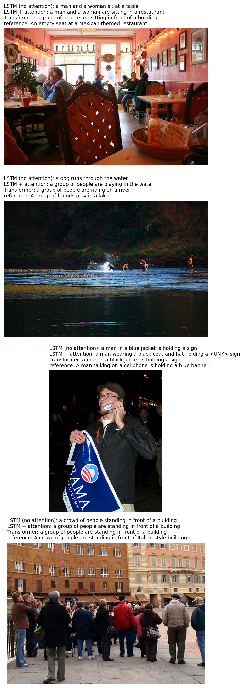
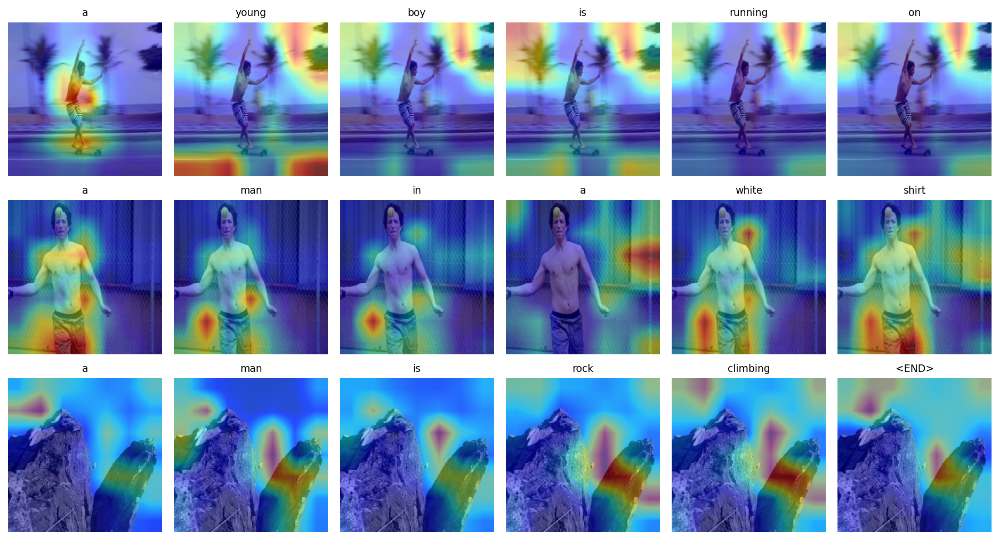
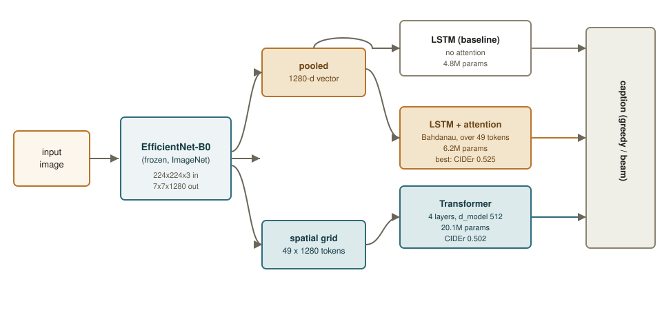

# Vision2Words

[](https://github.com/mahdisabetkish/Vision2Words/actions/workflows/ci.yml)
[](LICENSE)
[](https://huggingface.co/spaces/vision2words/vision2words)

Image captioning on Flickr8k, comparing an LSTM decoder with Bahdanau attention against a Transformer decoder, both reading the same frozen EfficientNet-B0 features, with a C++/ONNX Runtime inference path and a from-scratch training pipeline behind them.

<p align="center">
  
  &nbsp;&nbsp;
  
</p>

*Left: captions from all three decoders on test-split images the models never saw during training. Right: what the attention decoder is looking at for each word it writes.*

## What this is

The original version of this repository was a Flickr8k captioning prototype with a handful of real bugs: the model was trained to reproduce its input instead of predicting the next token, "epochs" meant one batch rather than a full pass over the data, nothing ran on GPU, and the saved checkpoint was never actually loaded back for inference. This repository is a full rebuild on top of that idea: a corrected training pipeline, two additional decoder architectures trained and evaluated against the original one, a C++ inference path that doesn't depend on Python or PyTorch at runtime, a Docker/Nextflow pipeline, and a Hugging Face Space.

Everything below reports real, measured numbers from this codebase, not expected or typical results. If a step in the pipeline hasn't been run and verified, this README says so rather than assuming it works.

## Architecture

<p align="center"></p>

A frozen EfficientNet-B0 (ImageNet weights, never fine-tuned here) encodes each image once. Its output feeds three interchangeable decoders through a shared interface:

- **LSTM (baseline)** -- conditions on a single pooled 1280-d vector. No attention. This is the architecture closest to the original prototype, corrected.
- **LSTM + attention** -- Bahdanau additive attention over the encoder's 7x7 spatial grid (49 tokens), re-weighted at every decoding step ("Show, Attend and Tell").
- **Transformer** -- a 4-layer Transformer decoder, d_model 512, causal self-attention plus cross-attention into the same 49 spatial tokens.

Feature extraction runs once and is cached to disk (`v2w extract-features`); training reads the cache, not the raw images, which is most of why training is fast on a single consumer GPU.

## Results

Flickr8k test split, 1000 images never seen during training. Full table and the figures above come from `v2w build-report`; raw numbers are in `results/metrics.json`.

| Decoder | Params | Decode | BLEU-4 | CIDEr | Latency (ms/img) |
|---|---|---|---|---|---|
| LSTM (baseline) | 4.8M | greedy | 0.172 | 0.443 | 15.4 |
| LSTM (baseline) | 4.8M | beam k=3 | 0.188 | 0.485 | 39.4 |
| LSTM + attention | 6.2M | greedy | 0.182 | 0.464 | 75.9 |
| LSTM + attention | 6.2M | **beam k=3** | **0.202** | **0.525** | 176.0 |
| Transformer | 20.1M | greedy | 0.181 | 0.460 | 93.9 |
| Transformer | 20.1M | beam k=3 | 0.198 | 0.502 | 160.5 |

Both attention-based decoders beat the no-attention baseline on every metric, and the attention-LSTM edges out the Transformer -- a believable outcome rather than a surprising one, since the Transformer's extra parameters (20M vs 6M) have less room to pay off on a dataset this small. These numbers are also in the range published for similarly-sized models on Flickr8k, which is some evidence the pipeline is sound rather than silently broken in a way that happens to produce plausible-looking numbers.

Latency here is decoder-only, measured on the training GPU (GTX 1080 Ti); see the C++ section below for a separate, apples-to-apples Python-vs-C++ comparison.

## Quickstart

### Python, pip

```bash
git clone https://github.com/mahdisabetkish/Vision2Words.git
cd Vision2Words
pip install -e ".[dev,export,metrics]"

v2w extract-features --raw-dir data/raw --feature-dir data/features --device cuda
v2w train --config configs/lstm_attention.yaml
v2w caption path/to/image.jpg --checkpoint checkpoints/lstm_attention/best.pt --vocab data/features/vocab.json --beam-size 3
```

The dataset downloads automatically on first use (from a public Hugging Face mirror that already carries the standard 6000/1000/1000 train/val/test split) if `data/raw` isn't already populated. See `configs/` for the three decoder configs and `src/vision2words/cli.py` for every `v2w` subcommand.

### Docker

```bash
docker build -f docker/Dockerfile.train -t vision2words-train .
docker run --rm --gpus all -v "$(pwd)/data:/app/data" -v "$(pwd)/checkpoints:/app/checkpoints" \
    vision2words-train train --config configs/lstm_attention.yaml
```

A second, much smaller image (`docker/Dockerfile.inference`) carries only the compiled C++ binary and ONNX Runtime -- no Python, no CUDA. See `docker/README.md`.

### Nextflow

```bash
nextflow run pipeline/main.nf -profile local,test   # a few minutes, tiny subset
nextflow run pipeline/main.nf -profile docker        # the real thing, containerized
```

`main.nf` wires the whole project together: download data, cache features, train all three decoders in parallel, evaluate each, build the comparison report, export decoders A and B to ONNX, and benchmark the C++ port against Python. See `pipeline/README.md`.

### C++

```bash
cd cpp
./scripts/fetch_third_party.sh          # or .ps1 on Windows
cmake -S . -B build -DCMAKE_BUILD_TYPE=Release && cmake --build build

v2w export-onnx --feature-dir ../data/features \
    --lstm-attention-checkpoint ../checkpoints/lstm_attention/best.pt \
    --transformer-checkpoint ../checkpoints/transformer/best.pt --out-dir ../export

./build/v2w_caption path/to/image.jpg --model-dir ../export --decoder lstm_attention --beam-size 3
```

See `cpp/README.md` for the export strategy (the attention decoder exports differently from the Transformer, for reasons that come up specifically with ONNX) and the full build walkthrough.

## C++ inference: does it actually match Python, and is it faster?

Measured on the training machine (Windows, GTX 1080 Ti, MSVC, ONNX Runtime 1.20.1 CPU execution provider). Full writeup in `results/cpp_report.md`.

- **Parity**: 12 of 16 test captions matched Python exactly (beam search, two decoders, 8 images). The 4 mismatches are close paraphrases, not garbage, and trace to `stb_image_resize2`'s resize filter not being bit-identical to PIL's -- the exported ONNX graphs themselves were separately verified against PyTorch to ~1e-6 precision.
- **Latency** (single image, model loaded once, mean of 50 runs):

  | Decoder | Python (CPU) | Python (CUDA) | C++ (CPU, ONNX Runtime) |
  |---|---|---|---|
  | LSTM + attention | 138.2 ms | 147.1 ms | **27.8 ms** |
  | Transformer | 221.7 ms | 202.3 ms | **182.8 ms** |

  C++ on CPU beats Python on both CPU and GPU here. That's not a GPU failing -- at batch size 1 with sequences under 20 tokens, kernel-launch and host/device transfer overhead outweighs the actual compute, while ONNX Runtime's CPU path has neither that round trip nor Python's per-step interpreter overhead.

## Hugging Face Space

A Gradio app ([`app/`](app/)) that captions an uploaded image with both decoders side by side and shows the attention decoder's word-by-word attention map. Runs on the free CPU tier; weights load from a Hugging Face model repo via `hf_hub_download`, never committed to this repository. `scripts/push_model_to_hub.py` and `scripts/push_space_to_hub.py` publish it -- neither runs automatically.

## Training details

- **Data**: [Flickr8k](https://www.kaggle.com/datasets/adityajn105/flickr8k), 8,091 images, 5 captions each, the standard 6000/1000/1000 split (see Citation below). Never committed to this repository; downloaded on demand.
- **Vocabulary**: words appearing at least 5 times in the training captions only, 2,541 words, plus `<PAD>`, `<START>`, `<END>`, `<UNK>`. Saved as JSON next to every checkpoint.
- **Encoder**: EfficientNet-B0, ImageNet weights, frozen. 224x224 input, ImageNet normalization.
- **Regularization**: dropout, weight decay, gradient clipping, `ReduceLROnPlateau`, early stopping on validation loss.
- **Reproducibility**: every run is seeded (Python, NumPy, PyTorch), and the resolved config is saved alongside the checkpoint it produced. The decoders have no convolutions, so there's no cuDNN nondeterminism to fight either -- rerunning a config reproduces the same validation loss to the digit (checked, not assumed).
- **Hardware**: a single GTX 1080 Ti. AMP is off by default (Pascal has no Tensor Cores, so there's nothing for it to buy).
- **Logging**: CSV and TensorBoard, per run, under `checkpoints/<run>/`.

## Testing

```bash
pytest tests/ -v
ruff check src/ tests/ scripts/ app/
ruff format --check src/ tests/ scripts/ app/
```

34 tests, well under 10 seconds on CPU: vocabulary round-tripping, dataset/collate shapes, forward-pass shapes for all three decoders, the attention decoder's `step()` function checked against its own `forward()`, greedy and beam decoding, a one-batch overfit sanity check, and ONNX export parity. GitHub Actions runs this plus a Docker build and a C++ build on every push and pull request.

## Project structure

```
src/vision2words/      the package: data, models, training, evaluation, inference
  data/                 Flickr8k download, vocabulary, feature caching, dataset/collate
  models/                three decoders behind one shared interface
  training/              the corrected training loop
  evaluation/             BLEU/CIDEr, decoding (greedy + beam), report/figure generation
  inference/               single-image captioning, ONNX export
configs/                YAML configs, one per decoder
tests/                  pytest suite
cpp/                    CMake project: ONNX Runtime inference, no Python at runtime
docker/                 training/eval image (CUDA) and a slim CPU inference image
pipeline/               Nextflow: the whole project, end to end
app/                    the Gradio Space
results/                metrics.json, comparison.md, figures, the C++ parity/benchmark report
scripts/                one-off utilities: pushing to the Hub, the C++/Python parity check
```

## Citation

```bibtex
@article{hodosh2013framing,
  title={Framing image description as a ranking task: Data, models and evaluation metrics},
  author={Hodosh, Micah and Young, Peter and Hockenmaier, Julia},
  journal={Journal of Artificial Intelligence Research},
  volume={47},
  pages={853--899},
  year={2013}
}
```

## License

[MIT](LICENSE).
